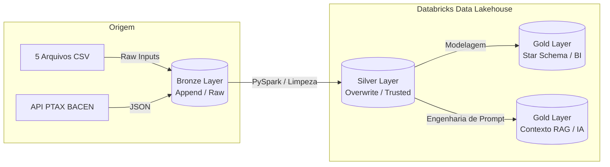
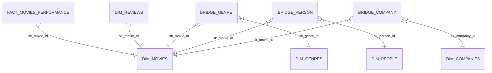

<h1 align="center">🎬 CineData Analytics | Data Lakehouse & ETL Pipeline</h1>

<p align="center">
  
  
  
  
</p>

> Projeto de Engenharia de Dados desenvolvido para estruturação de um catálogo cinematográfico (TMDB/IMDb). O pipeline implementa a **Arquitetura Medalhão**, processando ficheiros fragmentados e APIs para alimentar analíticas de BI e um Banco de Dados Vetorial para IA (Vector Search / RAG).

---

## 🏛️ Arquitetura de Dados (Medallion Architecture)

O pipeline foi desenhado visando tolerância a falhas, idempotência e governança via **Unity Catalog**, processado inteiramente em *Serverless Compute*.



---

## ⚙️ Engenharia do Pipeline (ETL)

### 🥉 Camada Bronze (Ingestão)
- **Leitura Resiliente:** Extração *as-is* de 5 ficheiros CSV (`inferSchema=False`) contendo metadados, finanças, avaliações e métricas de filmes.
- **Integração de API HTTP:** Extração em tempo real da cotação do dólar dos últimos 7 dias via API oficial do Banco Central do Brasil.
- **Rastreabilidade:** Adição automatizada do carimbo temporal `ingestion_datetime`.
- **Armazenamento:** Tabelas Delta criadas em modo `append` para preservação do histórico absoluto de cargas.

### 🥈 Camada Silver (Higienização e Regras de Negócio)
Camada focada na resolução de anomalias estruturais críticas (*Column Shift*, dados corrompidos) e normalização:
- **Resiliência Serverless (`try_cast`):** Tratamento de campos numéricos invadidos por texto. Valores incompatíveis são convertidos nativamente para `NULL`, evitando a interrupção do pipeline em modo ANSI.
- **Série Temporal Imputada (Forward Fill):** A API cambial não opera aos fins de semana. Utilização de *Window Functions* para propagar a cotação válida do último dia útil para os dias vazios.
- **Desnormalização Complexa (Explode):** Tratamento de separadores inconsistentes (`,`, `;`, `|`) nas colunas de Entidades (Diretores, Roteiristas, Estúdios), seguido de explosão linear para estruturação tabular.
- **Deduplicação de Entidades:** Remoção de duplicatas estritas e aplicação de limites lógicos (notas obrigatoriamente entre 0 e 10).

### 🥇 Camada Gold (Data Marts)

#### 1. Modelagem Dimensional (Star Schema)
Desenhado para consumo analítico de alta performance, mitigando problemas crónicos como *Join Explosion*.



- **Surrogate Keys:** Geração de chaves substitutas determinísticas particionadas (`sk_id`) geradas através de `row_number()` para desacoplar a modelagem do sistema de origem.
- **Bridge Tables (Tabelas-Ponte):** Resolução de relacionamentos muitos-para-muitos (M:N) sem inflacionar a Tabela Facto, garantindo que o faturamento de um filme nunca seja duplicado na agregação.
- **Facto Única:** 1 registo exclusivo por filme, consolidando lucro, margem (com tratamento *anti-divisão por zero*) e conversões padronizadas para BRL (`decimal(18,2)`).

#### 2. Base Documental para Inteligência Artificial (RAG)
Construção da tabela `gold_genai_movies_context` otimizada para Modelos de Linguagem (LLMs).
- **Engenharia de Documento:** Concatenação inteligente de Dimensões e Facto numa única *string* semântica (ex: *"O filme X, lançado em Y, faturou Z... estrelado por..."*).
- **Tratamento Anti-Nulo (*Coalesce*):** Estratégia de *fallback* rigorosa. Como a função `concat()` anula toda a linha se um único campo for nulo, a aplicação de `coalesce` (ex: substituindo uma receita vazia por *"não divulgada"*) garantiu 100% de integridade nos documentos vetoriais.

---

## 📊 Analytics e Validação de Negócio

Validação da estabilidade do *Star Schema* respondendo às exigências analíticas da diretoria:
1. Receita total do catálogo convertida em BRL (Cotação dinâmica).
2. *Top 5* absoluto de filmes por tração de popularidade.
3. Volumetria agregada de obras por género cinematográfico.
4. *Top 10* maiores faturamentos utilizando função de ordenação `RANK()`.
5. Ator com maior produtividade (*casting*) na janela móvel dos últimos 2 anos.
6. Produtora líder de lucro operacional (USD) no recorte dinâmico dos últimos 5 anos.
*(Nota: As janelas temporais foram ancoradas de forma dinâmica à data de lançamento máxima registada na base, ignorando obras em planeamento).*

---

## 📁 Organização do Repositório

```text
├── notebooks/
│   ├── Landing_to_Bronze.ipynb     # Ingestão e setup do Catalog
│   ├── Bronze_to_Silver.ipynb      # Higienização e regras de negócio
│   └── Silver_to_Gold.ipynb        # Star Schema, tabelas RAG e Analytics
├── job/
│   └── job.yaml                    # Definição YAML do Databricks Workflow
├── docs/
│   └── execucao_job.png            # Grafo de sucesso da orquestração
└── README.md
```

## 🔄 Orquestração (Databricks Workflows)
O pipeline está completamente automatizado através de um Job estruturado em *DAG* (Grafo Acíclico Dirigido):
* **Dependências:** `Task_Silver` obriga o sucesso de `Task_Bronze`; `Task_Gold` exige o sucesso de `Task_Silver`.
* **Ambiente:** Serverless Compute, garantindo gestão de recursos escalável e sem configuração de *cluster* manual.
